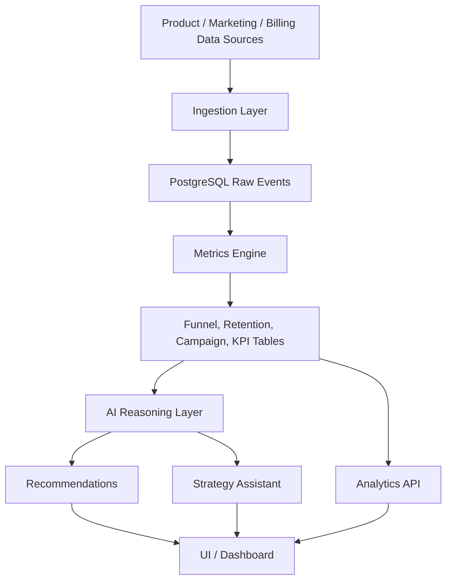

# AI Growth Intelligence Platform

AI-native growth decision system for startups and digital businesses.

## Product Thesis

Most analytics tools tell teams what happened. This platform is designed to tell them what to do next.

It combines funnel analytics, retention intelligence, campaign analysis, experimentation systems, and AI reasoning into one operating layer for growth teams.

## What Makes It Different

- Decision-first, not dashboard-first.
- Recommendation engine tied to impact, confidence, and effort.
- Historical memory of past experiments and strategic decisions.
- Growth metrics mapped to business levers, not vanity charts.
- AI assistant that explains why metrics changed and what to do next.

## Core User Problems

- Teams can see metrics but cannot prioritize actions.
- Growth bottlenecks are visible but root causes are unclear.
- Experiment backlogs are noisy and poorly ranked.
- Marketing, product, and leadership are looking at different versions of the truth.
- Existing BI tools require too much manual interpretation.

## Target Users

- Founders
- Growth leads
- Product managers
- Marketing teams
- Analysts
- RevOps / lifecycle teams

## Core Features

### 1. Funnel Analytics

- Acquisition funnel visualization
- Drop-off analysis by step
- Conversion tracking
- Journey breakdown by segment
- Bottleneck detection

### 2. Retention Intelligence

- Cohort tracking
- Churn prediction signals
- Engagement analysis
- Repeat behavior monitoring
- Retention driver identification

### 3. AI Growth Recommendations

- Experiment suggestions
- Acquisition strategy ideas
- Weak-stage detection
- Growth anomaly explanations
- Prioritization by expected leverage

### 4. Campaign Analysis

- CAC and LTV estimation
- ROI tracking
- Channel comparison
- Budget efficiency insights
- Campaign performance narratives

### 5. AI Strategy Assistant

- Natural language Q&A
- KPI summaries
- Weekly growth reports
- Strategic recommendations
- Leadership-ready narratives

## Architecture

## Suggested Tech Stack

### Frontend

- React
- TailwindCSS
- Recharts or Chart.js
- Optional: shadcn/ui for structured components

### Backend

- FastAPI preferred for analytics-heavy workflows
- Node.js acceptable if you want a full JavaScript stack
- Background workers for metric refresh, alerts, and AI report generation

### Data

- PostgreSQL
- Optional vector store for historical insight retrieval
- Event warehouse tables for raw and aggregated analytics

### AI

- OpenAI API or Claude API
- Prompted reasoning for recommendations and executive summaries
- Retrieval over past experiments, reports, and insights

### Deployment

- Vercel for frontend
- Railway or Render for API and workers
- PostgreSQL managed database

## Product Logic

### Metric Flow

1. Ingest raw events and campaign data.
2. Normalize events into a clean schema.
3. Build funnel, cohort, and KPI aggregates.
4. Detect anomalies, drop-offs, and retention risk.
5. Generate AI recommendations with business context.
6. Persist recommendations and user feedback for learning.

### Recommendation Output Format

Each recommendation should include:

- Observed problem
- Supporting evidence
- Likely root cause
- Suggested action
- Expected impact
- Confidence score
- Effort estimate
- Measurement plan

## KPI Framework

### North Star KPI

Choose one business-specific primary value metric, such as:

- Weekly active users completing the core action
- Qualified conversions per week
- Retained active customers
- Revenue-producing transactions

### Supporting KPIs

- Activation rate
- Funnel conversion rate
- Time to first value
- Retention rate
- Churn rate
- CAC
- LTV
- Payback period
- Expansion rate
- Experiment velocity

## Database Schema

### Core Tables

- organizations
- users
- projects
- data_sources
- events
- sessions
- funnels
- funnel_steps
- cohorts
- retention_snapshots
- campaigns
- campaign_spend
- kpis
- kpi_snapshots
- experiments
- experiment_variants
- experiment_results
- growth_recommendations
- ai_reports
- ai_conversations
- anomaly_detections
- alerts
- insight_history

### Design Principles

- Keep raw events immutable.
- Store aggregates separately from source data.
- Persist recommendation history.
- Track experiment outcomes to improve future prioritization.
- Store custom KPI definitions per organization.

## UI / UX Structure

### Navigation

- Overview
- Funnels
- Retention
- Campaigns
- Experiments
- Recommendations
- AI Assistant
- Reports
- Settings

### Dashboard Layout

- Top-level KPI strip
- Funnel visualization with drop-off annotations
- Cohort retention heatmap
- Campaign comparison table
- Ranked AI recommendation feed
- AI question panel
- Weekly executive summary card

### Visual Direction

The interface should feel like a growth command center:

- High information density, but clear hierarchy
- Strong visual separation between metrics and recommendations
- Business language, not analyst jargon
- Clear paths from insight to action

## Roadmap

### MVP

Build the smallest version that proves decision usefulness.

- Auth and project setup
- Event ingestion
- Funnel analytics
- Retention view
- Campaign performance view
- Basic KPI summary
- AI-generated growth recommendations

### V1 Intelligence Layer

- Anomaly detection
- Cohort segmentation
- Experiment tracking
- AI strategy assistant
- Weekly report generation
- Historical recommendation archive

### Advanced Version

- Multi-source integrations
- Custom metric builder
- Forecasting and scenario planning
- Causal analysis support
- Recommendation feedback loop
- Team collaboration and approvals

## Differentiators

- AI recommendations tied to business impact.
- Memory of past experiments and outcomes.
- One system for growth, product, and marketing decisions.
- Narrative reporting for founders and operators.
- Metric trees that connect KPIs to actionable levers.

## Startup Use Cases

- SaaS: improve trial-to-paid conversion and activation.
- DTC: compare channel efficiency and margin-adjusted LTV.
- Marketplace: monitor liquidity and funnel drop-off.
- Consumer app: improve retention and habit formation.
- B2B product: identify onboarding friction and expansion opportunities.

## Resume-Ready Positioning

Built an AI-powered growth intelligence platform that unifies funnel analytics, retention analysis, campaign performance, and AI-driven strategic recommendations to help startups identify bottlenecks and prioritize high-impact experiments.

## Interview Story

Use this structure:

1. Problem: teams have data but lack decision clarity.
2. Insight: growth needs an operating system, not isolated charts.
3. Solution: combine metrics, anomaly detection, experimentation, and AI reasoning.
4. Differentiation: the platform explains what changed, why it matters, and what to do next.
5. Outcome: faster prioritization and better growth decisions.

## Implementation Notes

If you want to build this as a portfolio project, the best sequencing is:

1. Define the North Star KPI and metric tree.
2. Build event ingestion and the PostgreSQL schema.
3. Add funnel and retention analytics.
4. Add campaign tracking and ROI views.
5. Implement AI summaries and recommendations.
6. Add experiment tracking and learning memory.
7. Polish the UI into a founder-grade growth cockpit.

## Optional Next Step

If you want, the next iteration can be:

- A full PRD
- A technical architecture document
- A database schema SQL file
- A React/FastAPI starter scaffold
- A portfolio case study write-up
